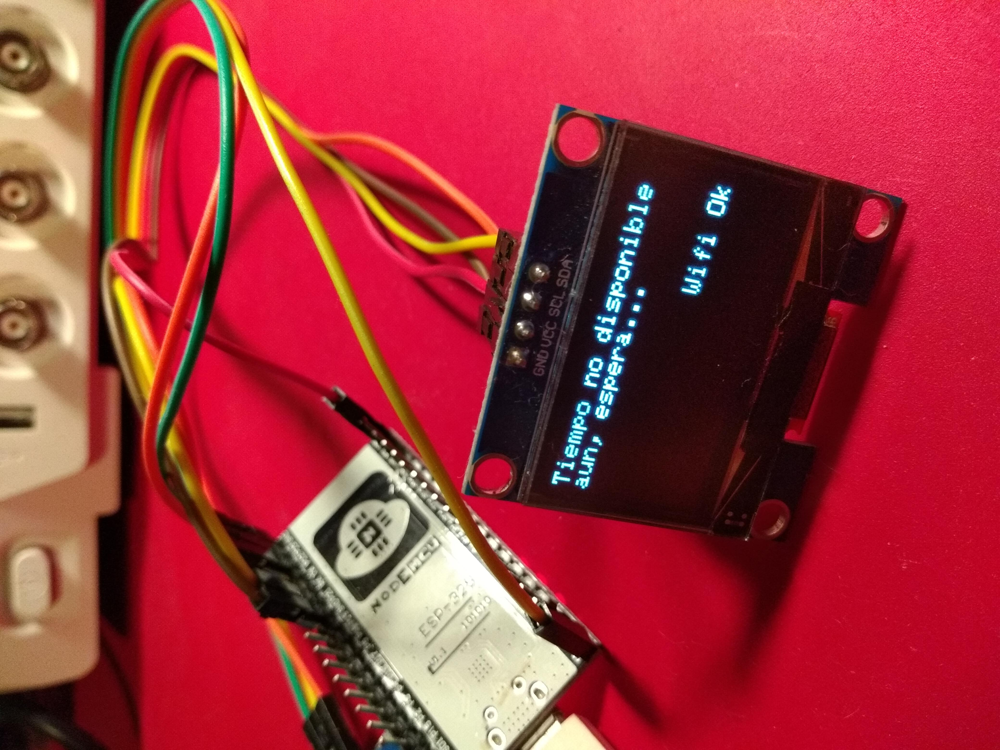

# cafetime-freertos-esp32
A wifi programmable electric outlet to turn the coffee maker up in the morning

This FreeRTOS solution is composed of 7 tasks:
* TaskBlink (just a testing blink over GPIO)
* TaskTester (send fake commands to the queue sequentially)
* TaskDisplay (updates OLED)
* TaskStateMachine (monitors commands and time events and produces the state changes)
* TaskNetworkTime (sync with NTP every 15 min)
* TaskInternalTime (keeps internal time running)
* TaskWebServer (handles HTTP requests, letting users change states)

MCU is Espressif ESP-WROOM-32 (aka NodeMCU-32s)  
OLED is SH1106 connected via I2C

RAM used: 12% (used 41k bytes from 327k bytes)  
Flash used: 58% (used 770k bytes from 1.3M bytes)

IDE is Platformio.

## Design

The main idea comes from another personal project, an ESP8266 bedside clock. My boss asked me why I didn't just bought one...

The idea behind this clock was to synchronize via NTP, while being able to keep showing the time if WiFi is temporary out.
Based on that concept I needed a "schedule" feature to activate a relay. This way, I can program the device to power up the coffee maker in the morning, a few minutes before I get up. 

I chose ESP32 over ESP8266 because the dual-core MCU is more interesting for a FreeRTOS project.

There are two mutexes being used for critical parts:
* access to current time components (hour, min, sec)
* access to scheduled time components

And one semaphore for synchronization:
* wait for a state change (used at webserver)

The state machine has 5 states:
* Idle (outlet power off)
* Scheduled, waiting for specific time (outlet power off)
* Making Coffee (outlet power on)
* Keeping warm (outlet power on)
* Power manually forced on (outlet power on)

The web interface lets the user change states and schedule the power up time.  
Web UI has been kept to a minimum because of space constraints.  
The OLED shows the device IP and a random 4-character passcode that is required when accessing via HTTP.

## Images

## Demo Video

[Realtime debug demo - YouTube video](https://youtu.be/YvznlkldbMA)
